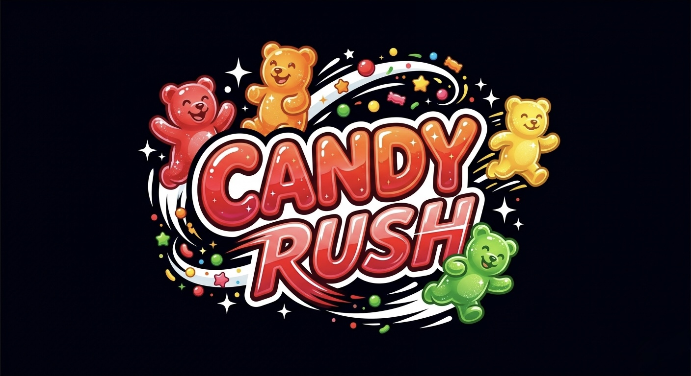

# Candy Rush: Glide Adventure

This Glide Adventure is a fast candy-world race where players bounce on jello, jump of falling gumdrops, and glide to  collect gummy bears before time runs out. Sweet, chaotic, and built for quick competitive fun.

## Game Modes

### Solo Run

Race through the candy course, collect all the gummy bears, and try to beat your best time on the leaderboard.

### Team Battle

Choose green or purple, collect your team's gummy bears, and outscore the other side before the 5-minute countdown ends.

## Features

- Bouncy jello jumps and candy-platform movement.
- Falling gumdrops with shake-and-drop effects.
- Sticky candy stripes that slow players like glue.
- Team-specific collectibles and scoring.
- Countdown, collect, victory, loss, draw, and music theme sounds.
- Custom Candy Rush UI, lobby, mode select, and result screens.

## Built With

Candy Rush is a Decentraland SDK7 scene built for quick multiplayer arcade sessions.
